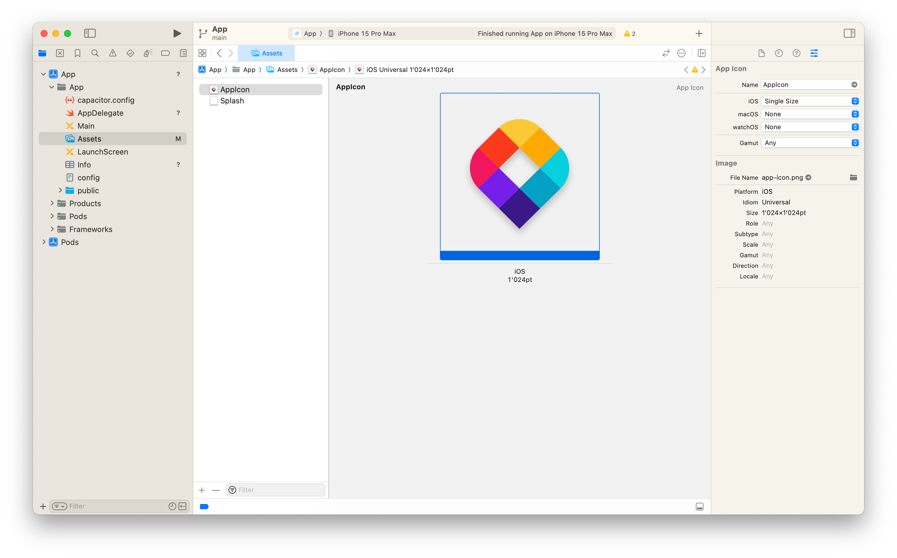

<p align="center">
  <a href="https://docs.maptiler.com/sdk-js/">official page →</a><br>
  
</p>

<p align="center" style="color: #AAA">
  Build a native mobile app with <a href="https://docs.maptiler.com/sdk-js/">MapTiler SDK</a> and <a href="https://capacitorjs.com/">Ionic Capacitor</a>
</p>

<p align="center">
  
  
  </img>
</p>


## Let's create a native mobile app with great maps! 🗺️ 📱  🤖
The goal of this repo is to leverage the web stack we are already familiar with (TS/JS, CSS, ViteJS) along with [MapTiler SDK](https://docs.maptiler.com/sdk-js/) to create an actual native mobile app that can be pushed to Apple AppStore and Google Play. 

For this project, we started from the [ViteJS Vanilla TypScript sample project](https://vitejs.dev/guide/#trying-vite-online), and then followed [the Ionic Capacitor instructions](https://capacitorjs.com/docs/getting-started#add-capacitor-to-your-web-app) to give our project mobile super powers!

## What did we add?
### Mobile-friendly geolocation
The geolocation control originally available in MapTiler SDK is web-specific and even though it will work when encapsulated into a mobile app, using it will trigger two user-agreement panel: one at the web-view level, and the next at system level. A more elegant way to do is to use `@capacitor/geolocation`, an official plugin that uses directly the geolocation from the system. We had to modify the settings of the native projects (both Android and iOS) to grant the app the permission to use geolocation. You can read more about this on [the plugins's page](https://capacitorjs.com/docs/apis/geolocation).

To make it simpler to integrate, we have created a SDK-friendly control that you find in `src/universalgeolocatecontrol.ts`. Note that this also works in a regular web page as te plugin provides a complete fallback.

### Safe insets
The *safe insets* are the margins that need to be put so that the content you display on screen does not step on the system display such as the status bar on top or the bottom menu on iOS. They are defined as CSS environment variables that you can directly leverage in your styling.  

For instance, MapTiler SDK and MapLibre stylesheet define few classes that apply to the *controls* called `.maplibregl-ctrl-yyy-xxx`. Our mobile app can define more properties to these classes in order to prevent the visual elements to clash with the system display. Let's add these lines to `src/style.css`:

```css
.maplibregl-ctrl-top-right {
  top: env(safe-area-inset-top);
}

.maplibregl-ctrl-top-left {
  top: env(safe-area-inset-top);
}

.maplibregl-ctrl-bottom-right {
  bottom: env(safe-area-inset-bottom);
}

.maplibregl-ctrl-bottom-left {
  bottom: env(safe-area-inset-bottom);
}
```

And let's make sure our app's `viewport` has the following attributes in the `index.html`:

```html
<meta
  name="viewport"
  content="viewport-fit=cover, width=device-width, initial-scale=1.0, minimum-scale=1.0, maximum-scale=1.0, user-scalable=no"
/>
```

Here is the result:

| ❌ Without safe insets   | ✅ With safe insets |
|----------|:-------------:|
|  |   |

> **Note:** the *safe insets* values will be `0` in a web browser, so it will not impact your layout to include them in all cases.

## Make it yours!
Clone this repo and start to play with it! you will have to follow some steps:
- rename `.env.sample` to `.env` and replace the value of `MAPTILER_API_KEY` by your actual key
- modify the content of the file `capacitor.config.ts`
- App name / logo / bundleID
- In terminal run `npx npm run build` && `npx cap sync`
- To run directly on ios in terminal type `npx cap run ios`, or type `npm run open-xcode` to open the iOS project.

You can then tune a few things. For instance, the target iOS version:


If you plan to distribute your app, you will also have to deal with **signing** by associating it to a **Team**:


on the left-side menu `App/App/Assets`, you can change the icon of your app. Simply drag-n-drop an non-transparent image in the icon frame:


### Modify the source
The project itself reuses the structure of the ViteJS boilerplate, meaning the project source is located in the `src/` directory and can be ran in a regular web browser:
- in dev/watch mode: `npm run dev`
- build a production bundle: `npm run build`

After building the project for production, ViteJS lets you use the command `npm run preview` to run the prod locally.

### Update the mobile app
Both mobile projects (XCode workspace and Android Studio Workspace) need to be updated after the web project has been built for production. To make this happen:  

```bash
npm run sync
```

If you move your focus back to XCode or Android Studio, you may see a popup asking if you want to refresh the project based on the updates, select "yes" (or "Read from disk" in XCode).

Then the projects in XCode and Android Studio will need to be built again and finally, your latest changes should show.

## What about PWA?
[Progressive Web Apps](https://developer.mozilla.org/en-US/docs/Web/Progressive_web_apps) are web apps hosted online, like any website, but they are shipped with a few extra settings in a *manifest* file. We are not going to cover this here, but it's worth mentioning that your web app does **not** need to comply to the PWA set of rules to be wrapped inside a native mobile app with Capacitor. Those are two very different things, both with their *pros* and *cons*.

That being said, with this project as a starter (or any Capacitor app), you could could develop with a single codebase an app that is fully:
- a web app hosted online and people visit with a regular web browser
- a PWA that people can turn into a semi-app (in some condition: Android, EU-iPhone, etc.)
- a Capacitor-powered native web app wrapped to distribute on Apple AppStore and Google Play